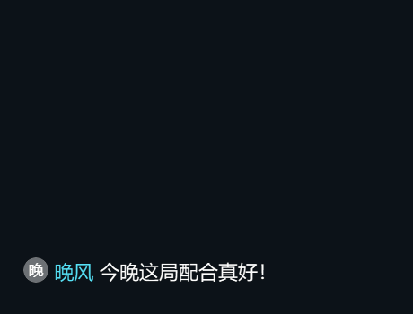

<p align="center">
  
</p>

# Starveil · 星幕

**Windows 下的斗鱼弹幕工具。** 支持透明飘屏、礼物展示、直播间统计和弹幕记录查询。

[English](README.en.md) · [下载 Windows 版](https://github.com/qxpdev/Starveil/releases) · [使用指南](docs/usage.md) · [更新记录](CHANGELOG.md)

[](https://github.com/qxpdev/Starveil/actions/workflows/windows.yml)

[](LICENSE)

中文名“星幕”，使用 Electron + TypeScript 开发，支持 **Windows 10 / 11 x64**。

## 效果演示

| 边缘沉浸 | 由下而上的消息流 |
| --- | --- |
|  |  |

演示来自实际程序，使用模拟弹幕；字体、排版、透明度和动效均可调整。深色底图用于展示透明浮层。

## 主要功能

| 功能 | 说明 |
| --- | --- |
| 透明弹幕窗口 | 多显示器、置顶、鼠标穿透、位置记忆；支持横向、纵向与边缘显示 |
| 边缘沉浸 | 新消息从底部侧边进入，已有消息按序平滑上移；空闲时消息自动退出 |
| 平滑动效 | 非线性上移，连续消息延续当前运动；可调速度，支持关闭动效与系统减少动态效果 |
| 礼物与抽奖 | 透明礼物栏、醒目金额、价值分色；区分抽奖投入、奖励和待确认价格 |
| 官方礼物素材 | 按广播与目录匹配礼物图片、礼物条和支持的 VAP 透明动画；不支持的格式回退图片 |
| 斗鱼表情 | 普通表情、钻粉梗、钻粉及房间表情，失败时回退原文 |
| 独立统计栏 | 可在边缘模式常驻，位置、字号和透明度独立调整 |
| 记录与查证 | 按日期、房间和用户查看礼物、已记录消费及开启保存后的弹幕，支持 Excel 导出 |
| 存储管理 | 缓存路径可选，清理前列出删除范围，保留配置、手动补价和已保存记录 |

边缘消息流即时接收新消息，满屏时让最旧消息退出；礼物到顶部可额外停留，下方消息继续上移。高能弹幕仅在实际收到新增广播且平台返回正文时显示。

## 开始使用

1. 在 [Releases](https://github.com/qxpdev/Starveil/releases) 下载 `Starveil-<版本>-win-x64.exe` 并运行，无需安装 Node.js。历史版本可能仍使用“星幕”文件名。
2. 确认或修改预填的斗鱼房间号，也可粘贴直播间链接，然后点击 **启动飘屏**。
3. 打开 **调整外观与规则**。外观滑杆拖动时实时生效，松开后保存；顶部出现“已保存”表示写入成功。
4. 关闭主面板会收进托盘。完全退出或更新程序时，请使用托盘菜单中的 **退出**。

首次启动使用内置设置：右侧边缘沉浸、18px 字号、1.0 行高、透明礼物底色和底部常驻统计栏。飘屏默认关闭，每日统计默认开启，弹幕正文保存默认关闭；已有配置始终优先读取。

保存正文需在设置中单独开启。用户消费汇总仅覆盖本机实际接收并记录的送礼和抽奖投入，不包含离线期间或开启前的记录。抽奖奖励单列，不重复计入投入。

## 配置与缓存

数据保存在 `%APPDATA%/douyu-danmaku-overlay/`。Starveil 更名后继续使用这个目录，更新 EXE 会沿用已有设置和记录。

- `config.json`：设置和手动礼物价格；`config.json.bak` 是上一份有效配置。
- `statistics/`：每日统计和用户礼物记录；`statistics/danmaku/` 保存已开启记录的弹幕正文。
- `cache/`：可清理的图片、表情目录及运行缓存；自定义位置继续使用专用 `xingmu-cache` 子目录。

缓存位置更改后重启生效，清理前会显示当前与旧缓存位置、可删类别和保留数据。完整目录、迁移步骤和统计口径见 [使用指南](docs/usage.md)。

## 开发与发布

需要 Windows、Node.js 20+ 和 pnpm 9.15.9。CI 使用 Node.js 22；Windows 自带的 .NET Framework C# 编译器用于构建桌面状态辅助程序。

```powershell
pnpm install --frozen-lockfile
pnpm dev
pnpm typecheck
pnpm test
pnpm dist
pnpm release:notes
```

`pnpm dist` 在 `release/` 生成 Windows 便携 EXE、SHA-256 校验文件和开源许可声明，并核验程序中的生产依赖与许可文件。`pnpm release:notes` 从更新记录生成当前版本的发布说明。构建过程只生成本地文件。

[参与开发](CONTRIBUTING.md) · [GitHub 上传与发布流程](docs/PUBLISHING.md)

## 来源与许可

Starveil 是 [qianjiachun/douyu-danmaku-overlay](https://github.com/qianjiachun/douyu-danmaku-overlay) 的衍生项目，并参考 [qianjiachun/douyu-monitor 的 remix 目录](https://github.com/qianjiachun/douyu-monitor/tree/main/remix)。两个项目原作者均为 **小淳**，均采用 **MIT** 许可证。

本项目采用 [MIT](LICENSE) 许可证。两个上游的版权声明、完整许可和引用说明见 [第三方来源与许可](THIRD_PARTY_NOTICES.md)，同时随 Windows 程序分发。
